# 🎬 CineVerse — AI-Powered Movie Discovery Platform

A full-stack movie and web series discovery platform with AI recommendations, 
OTT availability, trailers, watchlist and Google authentication.

## 🌐 Live Demo
👉 [cineverse-cinemaguide.netlify.app] (https://cineverse-cinemaguide.netlify.app)
### NOTE : "The website requires a non-JIO network or VPN due to TMDB API restrictions on certain Indian ISPs — a known infrastructure limitation, not a code issue."

## ✨ Features
- 🎬 Movie & Web Series Discovery (TMDB API)
- 🤖 AI CineBot recommendations (Groq/Llama 3)
- 📺 OTT availability (Netflix, Prime, Hotstar)
- 🎥 Inline trailer player
- ❤️ Personal Watchlist (Firebase Firestore)
- 🔐 Google Sign In/Out (Firebase Auth)
- 🌙 Dark luxury cinema UI

## 🛠️ Tech Stack
- HTML, CSS, JavaScript (Vanilla)
- TMDB API — Movie data
- Groq API — AI chatbot
- Firebase — Authentication + Firestore database
- Netlify — Deployment

## 🔑 Setup

1. Clone the repo
2. Get API keys:
   - TMDB: https://www.themoviedb.org/settings/api
   - Groq: https://console.groq.com
   - Firebase: https://console.firebase.google.com
3. Copy config.js → config.local.js and fill in your real keys
4. Open index.html with Live Server

## 📸 Screenshots

### 🏠 Home Page
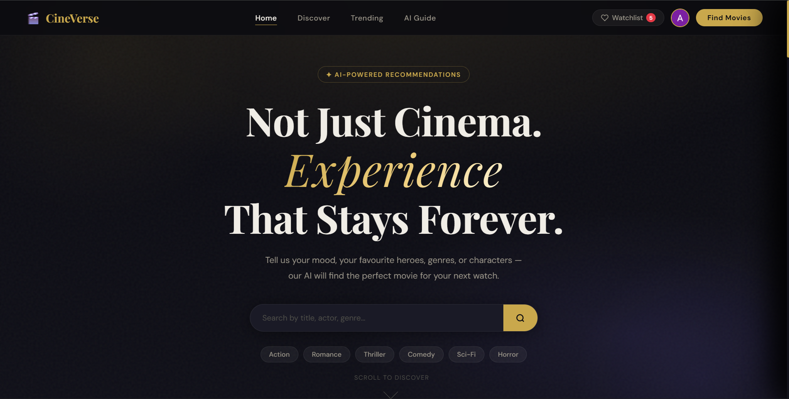

### 🎬 Discover
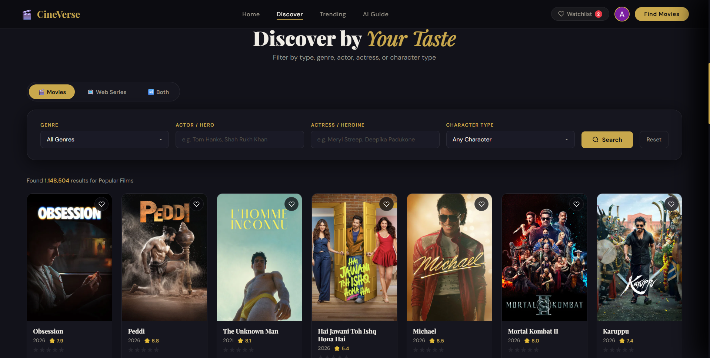

### 🔥 Trending
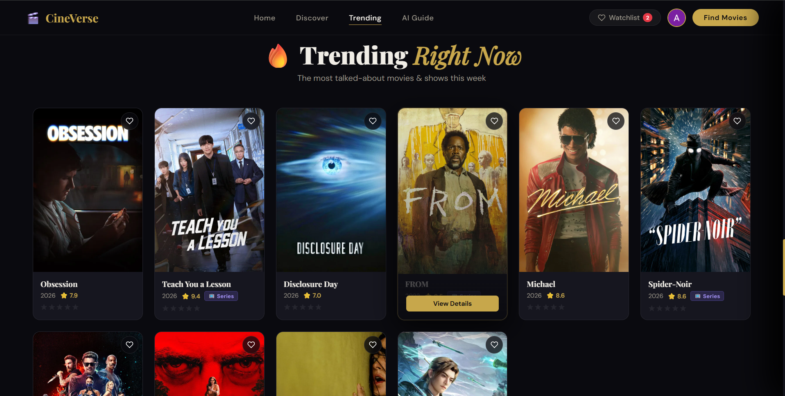

### 🎭 Movie Card Details
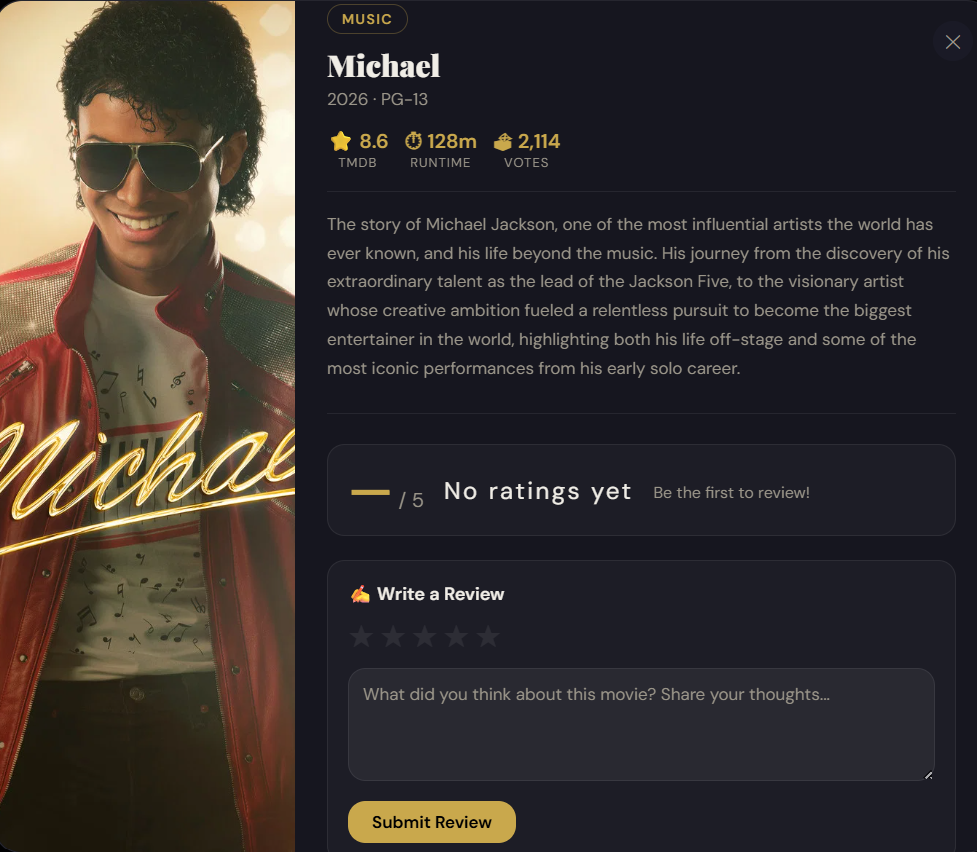
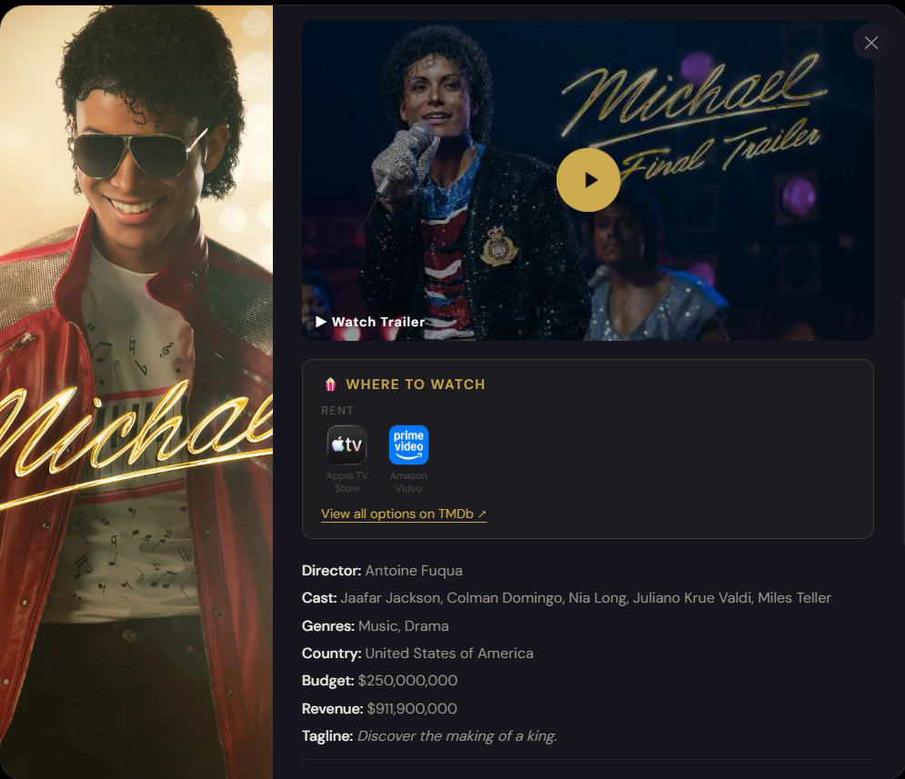
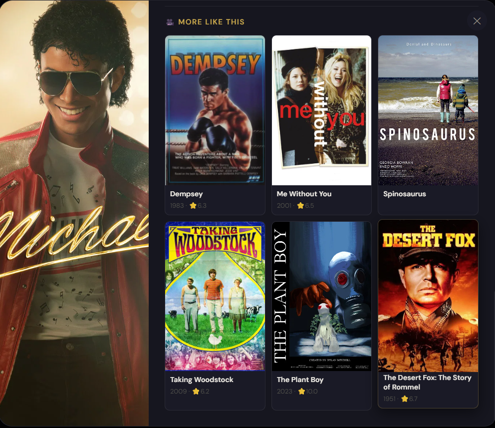

### 🤖 AI-ChatBot Feature
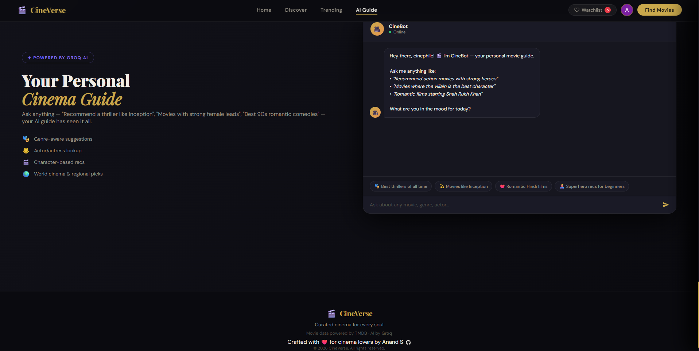
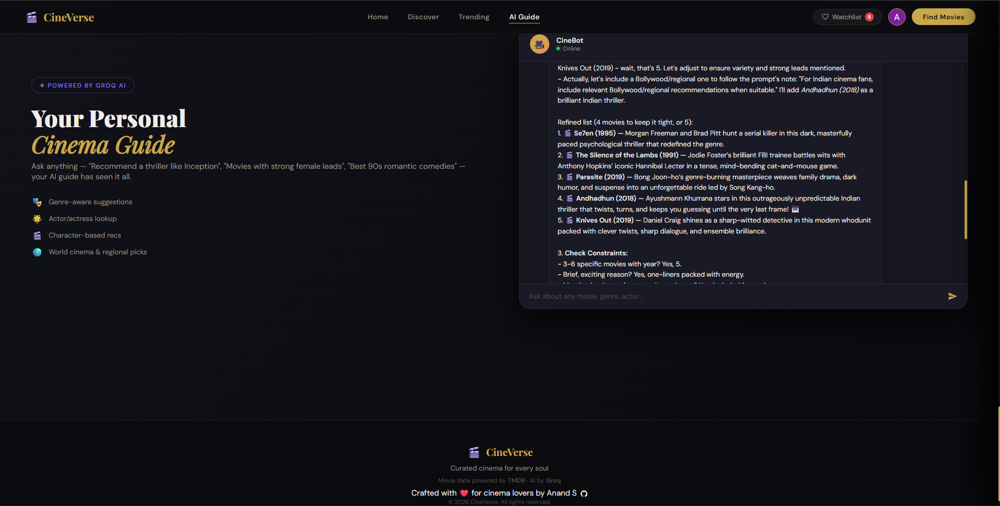

### 🙂 Profile
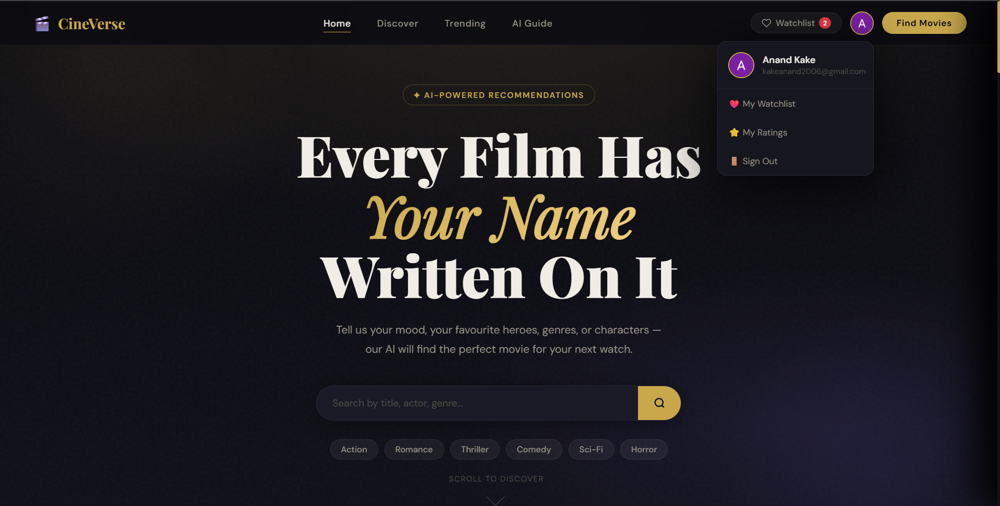

### ❤️ Watchlist
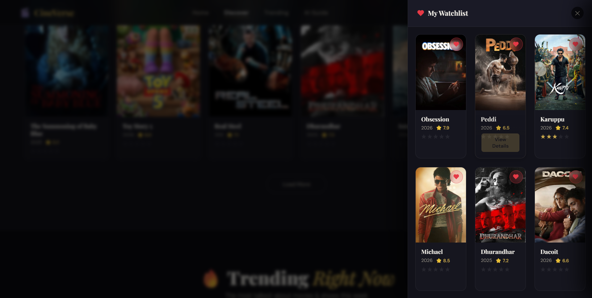

### ⭐⭐⭐ Ratings
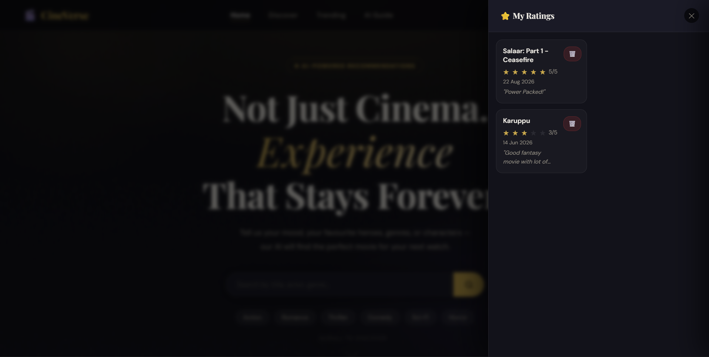

## 📁 Project Structure
